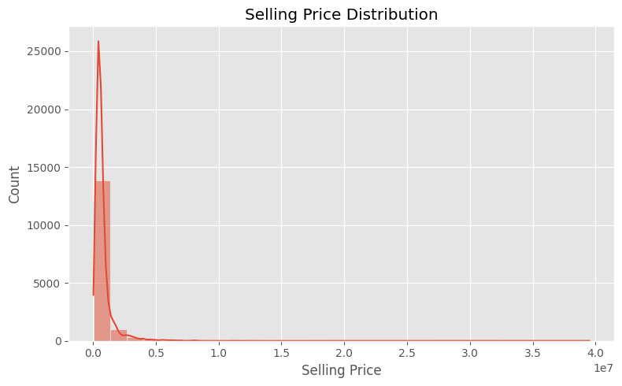
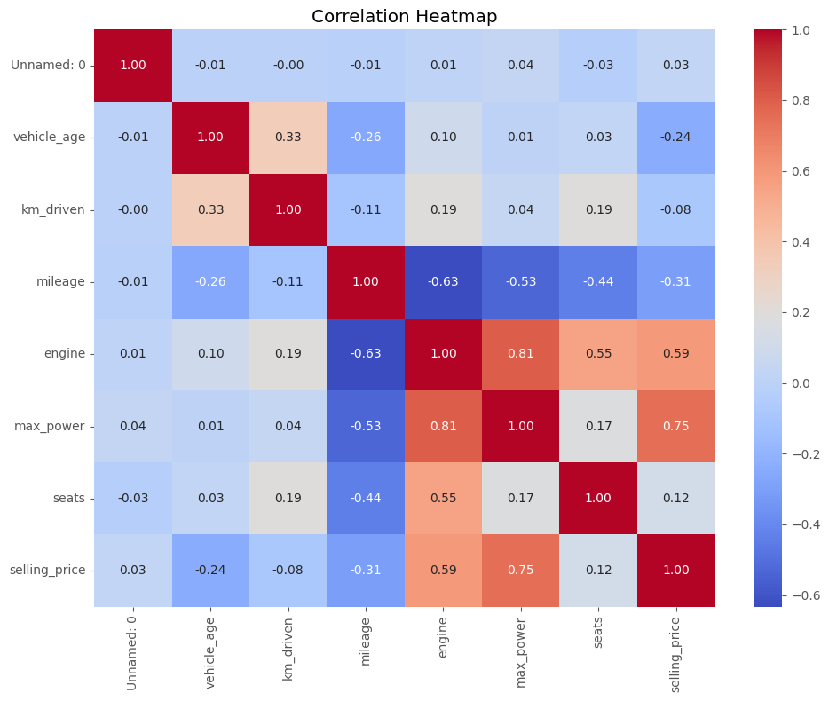
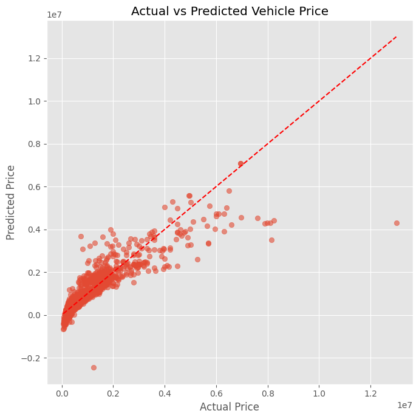

# 🚗 Vehicle Price Prediction Using Linear Regression

## 📌 Overview

This project demonstrates an end-to-end machine learning workflow for predicting used vehicle selling prices using **Linear Regression**. The project covers data exploration, preprocessing, feature engineering, model training, evaluation, and visualization using Python and Scikit-learn.

---

## 🎯 Objectives

- Analyze a real-world used car dataset
- Perform data preprocessing and feature engineering
- Train a Linear Regression model
- Evaluate model performance using regression metrics
- Visualize the relationship between actual and predicted prices

---

## 📂 Dataset

The dataset contains information about used vehicles, including:

- Vehicle Age
- Kilometers Driven
- Fuel Type
- Seller Type
- Transmission Type
- Mileage
- Engine Capacity
- Maximum Power
- Number of Seats
- Selling Price (Target Variable)

---

## 🛠️ Technologies Used

- Python
- Pandas
- NumPy
- Matplotlib
- Seaborn
- Scikit-learn
- Jupyter Notebook

---

## 📊 Project Workflow

```
Load Dataset
      │
      ▼
Exploratory Data Analysis
      │
      ▼
Data Preprocessing
      │
      ▼
Feature Encoding
      │
      ▼
Train-Test Split
      │
      ▼
Feature Scaling
      │
      ▼
Linear Regression Model
      │
      ▼
Prediction
      │
      ▼
Model Evaluation (R² Score & RMSE)
      │
      ▼
Visualization
```

---

## 📈 Exploratory Data Analysis

The following analyses were performed before model training:

- Dataset overview
- Missing value analysis
- Statistical summary
- Selling price distribution
- Correlation heatmap
- Vehicle age vs. selling price
- Top vehicle brands

---

## 🤖 Model

**Algorithm Used**

- Linear Regression

### Data Preprocessing

- One-Hot Encoding for categorical features
- StandardScaler for numerical feature scaling
- Train-Test Split (80:20)

---

## 📊 Model Evaluation

The model was evaluated using:

- **R² Score**
- **Root Mean Squared Error (RMSE)**

Additionally, an **Actual vs Predicted Price** scatter plot was created to visualize model performance.

---

## 📁 Repository Structure

```
Vehicle-Price-Prediction-Using-Linear-Regression
│
├── data/
│   └── cardekho_dataset.csv
│
├── notebooks/
│   └── Vehicle_Price_Prediction.ipynb
│
├── src/
│   └── train.py
│
├── images/
│
├── README.md
├── requirements.txt
├── LICENSE
└── .gitignore
```

---

## 🚀 Installation

Clone the repository

```bash
git clone https://github.com/mahika74/Vehicle-Price-Prediction-Using-Linear-Regression.git
```

Navigate to the project directory

```bash
cd Vehicle-Price-Prediction-Using-Linear-Regression
```

Install the required libraries

```bash
pip install -r requirements.txt
```

Run the training script

```bash
python src/train.py
```

---

## 📷 Sample Visualizations

### Selling Price Distribution



---

### Correlation Heatmap



---

### Actual vs Predicted Prices



## 💡 Future Improvements

- Compare Linear Regression with Ridge and Lasso Regression
- Experiment with Decision Tree and Random Forest Regression
- Perform Hyperparameter Tuning
- Build a Streamlit web application for deployment

---

## 👩‍💻 Author

**Mahika Bommana**

Aspiring Software Engineer | Machine Learning Enthusiast

- GitHub: https://github.com/mahika74
- LinkedIn: https://www.linkedin.com/in/mahikabommana

---
